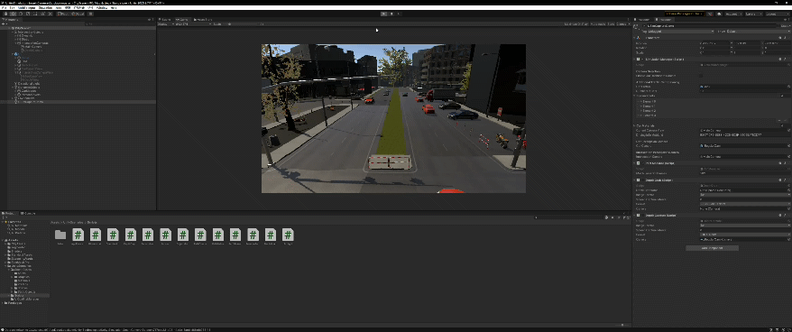

<!--
 * @Author: Xiang Pan
 * @Date: 2021-11-12 23:27:39
 * @LastEditTime: 2021-12-16 23:23:36
 * @LastEditors: Xiang Pan
 * @Description: 
 * @FilePath: /project/README.md
 * @email: xiangpan@nyu.edu
-->
# Sim4Real: Simulation Data for Realistic Semantic Segmentation Model
Xiang Pan (xp2030), Yuxuan Sun (ys4375)

Check our [slides](./docs/XiangPan_YuxuanSun_PPT.pdf)




# Models and Datasets
All the simulation trained models are stored in cached_models and cached_datasets. The model loader and dataset definition can be found as task_models and task_datasets.
 
# How to run the code
you can check the ./scripts for locally running. And you can also use scripts in ./slurm_scripts to run in HPC of NYU.

# Example
## Training from scratch
```
python main.py --gpu 0 --task_name=KITTI
```
## Trasfer from simulation learned model
```
python main.py --gpu 0 --task_name=KITTI --load_checkpoint_path=cached_models/unity-streetview-low-res_mIOU=0.77.ckpt --log_name=streetview-low_kitti
```


